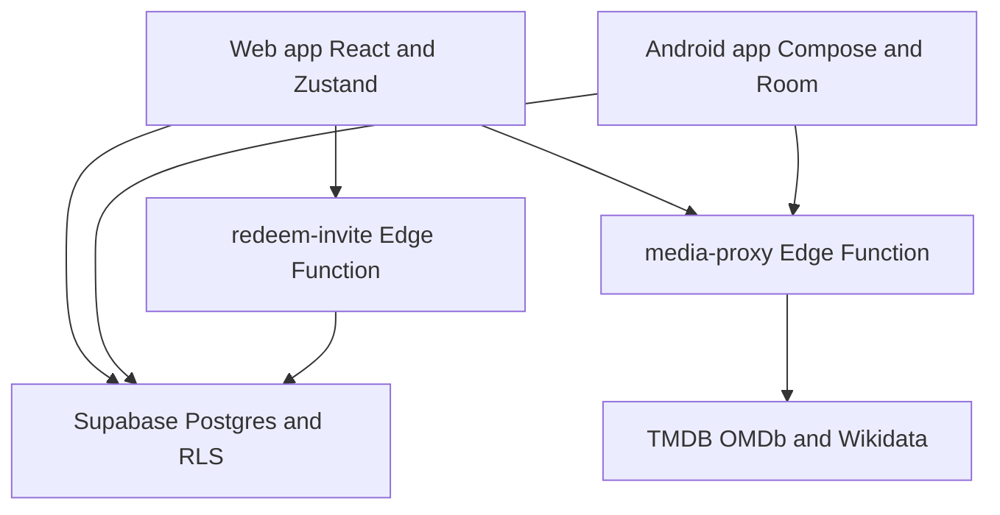

# CinemArchive multi-client architecture

CinemArchive has two peer clients over shared Supabase infrastructure. [ADR 0002](../../docs/adr/0002-multi-platform-repo-layout.md) formalizes the repository boundary: `apps/web/` and `apps/android/` own platform code, while `schema.sql`, `supabase/migrations/`, and `supabase/functions/` remain shared.



This diagram shows the deliberate ownership boundary: clients share backend services but retain platform-specific state and UI models.

## Client responsibilities

| Area | Web | Android |
|---|---|---|
| UI and state | React 19, Vite, TypeScript, Zustand, Tailwind/Radix | Kotlin, Jetpack Compose, Material 3 |
| Local data behavior | In-memory/persisted client state; owner library loaded through `lib/db.ts` | Room read model, repositories, durable mutation outbox |
| Navigation | URL state and deep links through `navigation.ts` and `useNavigationSync.ts` | Single Android app module with feature modules and navigation surfaces |
| Offline posture | PWA app-shell caching; normal persistence is remote Supabase | Local-first cached reads and incremental server synchronization |
| Tests | Vitest plus focused verification scripts | Gradle/JVM tests across model, data, and database modules |

The web client **reads and writes through** `apps/web/src/lib/db.ts`; the Android client **shares the same backend but synchronizes through** repositories in `apps/android/data/`. This distinction is central when changing a shared domain: a browser update can be immediately remote, while Android must preserve Room mapping, cursor pull, and queued-write semantics. See [Workflows](../workflows/index.md).

## Web application

`apps/web/src/main.tsx` mounts `App.tsx`. `App.tsx` code-splits views and resolves the initial read context:

- `?share=<token>` enters the anonymous shared-library path.
- A normal authenticated session calls the owner-library path.
- `?friend=<userId>` is resolved only after authentication because friend-read RLS depends on `auth.uid()`.

`useAppStore.ts` owns library data, UI state, lists, outings, notification state, and client-side derivations. Mutations update local state optimistically and use `lib/db.ts` for async persistence; errors are surfaced through retryable UI feedback. The store’s title graph includes TV seasons, episodes, independent watch/rating/review logs, viewing history, credits, lists, and owner-only cinema outings.

## Android application

`apps/android/settings.gradle.kts` defines the layered Android project:

```text
:app
:core:model
:core:database
:core:designsystem
:data
:feature:auth, :feature:discover, :feature:library, :feature:upnext
:feature:ledger, :feature:lists, :feature:settings
```

`CinemArchiveApplication.kt` wires Room, the Supabase REST client, repositories, `LibrarySyncRepository`, and `MutationOutbox`. On app creation it starts a library sync, then reconciles due cinema outings; it separately attempts queued mutation delivery. Compose features should use these repositories rather than calling Supabase directly.

Android therefore **depends on** the shared schema’s sync RPC and tombstones, described in [Workflows](../workflows/index.md#android-local-first-sync). `docs/android-sync-contract.md` and `docs/android-contracts/` give deeper field-level guidance, but some status wording there is historical; the migration and current Kotlin code are the implementation evidence.

## Shared backend and security

`schema.sql` is the readable reference for the database and RLS policies; `supabase/migrations/` is the ordered deployable history. Core shared domains include:

- titles, seasons, episodes, independent episode activity logs, and viewings;
- metadata credits and `api_cache`;
- private lists and list items;
- cinema outings;
- profiles, friendships, sharing scopes, comments, reactions, recommendations, notifications, and invite codes;
- Android synchronization metadata, including tombstones and `sync_library_changes`.

RLS grants owners access to their rows and selectively permits read-only shared or friend access. Shared links set `app.shared_token` through an RPC before content reads; optional scopes can narrow access by genre or status. Cinema outings are owner-only. These authorization boundaries **constrain every workflow** in [Operations](../operations/index.md), so a UI guard is not a substitute for an RLS policy.

## Edge Functions

| Function | Role | Boundary |
|---|---|---|
| `media-proxy` | Proxies and caches media catalog requests | Keeps third-party API keys off both clients; supports search, details, seasons, credits, providers, discovery and related metadata actions. |
| `redeem-invite` | Validates and claims invite codes, then creates an account | Keeps invite-only account creation server-side and rate-limits redemption attempts. |

The web media wrapper sends query-string actions to `media-proxy`; Android’s `DiscoverRepository` uses the same gateway. This shared gateway **supplies metadata to both client architectures** while keeping its API secrets in the Edge Function environment.

## Change boundaries

- **Web-only presentation/state change:** start in `apps/web/src/`, then run web checks.
- **Android-only presentation/local feature:** start in the matching feature module and preserve repository/Room boundaries.
- **Shared domain change:** add a new migration, update `schema.sql`, inspect both client mappings, and update contract/parity material as warranted.
- **Authorization, sync, or Edge Function change:** treat it as cross-client infrastructure; review RLS/RPC behavior and deployment separately from UI work.

Use [Source reference](../source-reference.md) to locate entry points and [Testing and verification](../testing/index.md) to select checks.
