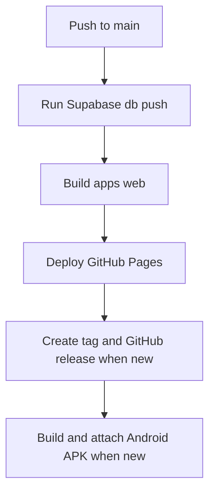

# Development and release operations

## Local setup

### Web

From `apps/web/`:

```bash
npm install
npm run dev
npm run test
npm run lint
npm run build
```

Use a local, untracked configuration file for the Supabase URL and publishable key. The browser must never contain TMDB or OMDb secrets; media requests go through the shared Edge Function.

### Android

From `apps/android/`:

```bash
./gradlew :app:assembleDebug :app:lintDebug testDebugUnitTest
```

Use `apps/android/local.properties.example` as the shape for local Supabase configuration. `local.properties` is deliberately untracked. Android uses Java 17, compiles against API 36, and has a minimum SDK of 31.

The two setup paths are separate because the repository intentionally does not use a JavaScript monorepo orchestrator. They converge only at shared services described in [Architecture](../architecture/overview.md).

## Database migrations

`supabase/migrations/` contains the deployable, timestamped migration history. `schema.sql` is the readable canonical schema/RLS reference and must remain synchronized with logical schema changes.

1. Create a new migration; do not edit an old applied migration.
2. Add DDL, RLS policies, RPC/trigger changes, and explanatory comments needed for the logical change.
3. Update `schema.sql` with the resulting current state.
4. Assess both clients: web database mapping and Android Room/sync/outbox mapping.
5. Run targeted tests and release through the established workflow.

Changes affecting owner data synchronization need special care: Android’s `sync_library_changes` stream, timestamps, tombstones, and remote mutation writer are part of the effective backend contract. See [Workflows](../workflows/index.md#android-local-first-sync).

## Deployment pipeline

`.github/workflows/deploy.yml` runs on push to `main` and via manual dispatch. It performs these dependent stages:



This diagram reflects the job dependencies in the deploy workflow. A failed migration prevents the web build, and a release APK is built only for a new release tag.

The build job runs in `apps/web/`; it installs dependencies and runs `npm run build`. The release job reads the canonical version from the root `package.json`, publishes the relevant changelog section, and the Android job computes the APK version from that release version.

`supabase/functions/media-proxy/` and `supabase/functions/redeem-invite/` deploy independently through `.github/workflows/deploy-functions.yml`. Updating a function source file without deploying it leaves the hosted behavior unchanged.

A separate manual `db-migrate.yml` exists, but the main deployment workflow itself also applies pending migrations. Treat the workflow source as authoritative if operational docs diverge.

## Security and secrets

- RLS in `schema.sql` is the authorization boundary for data. Client-side conditionals improve UX but do not grant access.
- Shared links use a server-side session setting and scoped RLS reads. Friend views require an authenticated user.
- `media-proxy` holds catalog-provider secrets. `redeem-invite` centralizes invite redemption and account creation.
- GitHub Actions receives deployment credentials from repository secrets/variables. Do not copy their values into documentation, source, or client configuration.
- Android release signing material is injected only in CI. Local release builds are intentionally unsigned when the release keystore is absent.

## Operational change checklist

1. Determine whether the change is web-only, Android-only, or shared infrastructure.
2. For a shared change, review RLS and deployability before UI work.
3. Keep migrations, `schema.sql`, and client contracts/mappings aligned.
4. Deploy Edge Functions independently when applicable.
5. Use [Testing and verification](../testing/index.md) before a release and follow the parity convention in `AGENTS.md`.
