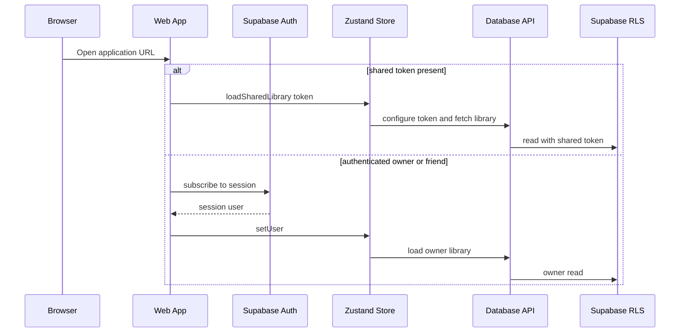
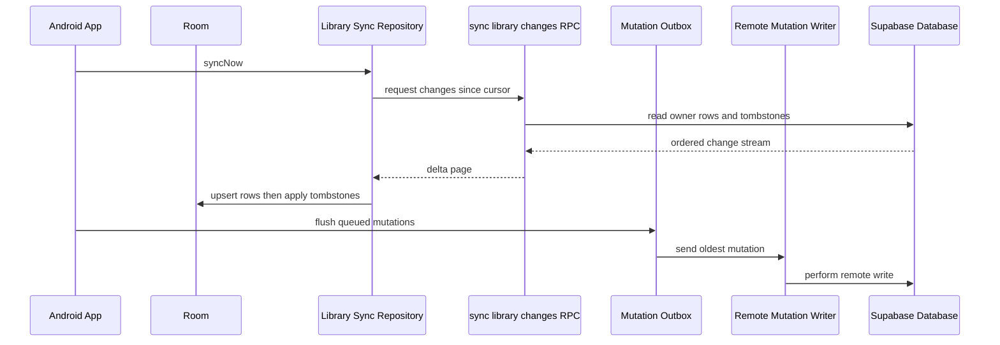

# Runtime workflows

This page focuses on the paths that cross client, persistence, and authorization boundaries. [Architecture](../architecture/overview.md) explains ownership; [Testing and verification](../testing/index.md) identifies the checks that protect these flows.

## Web startup and read scopes

`apps/web/src/App.tsx` chooses the read path from the URL and Supabase session.

This sequence shows why shared and friend links differ: a shared link can be resolved before a session, but a friend link is checked after authentication so the friend RLS policy can evaluate `auth.uid()`.

For owner loading, `useAppStore.ts` calls the database boundary to retrieve the nested title graph and owner-only outings, restores Ledger preferences, reconciles due outings, and loads lists. `lib/db.ts` holds the nested select and maps database rows into the client model. Shared and friend modes load a permitted, read-only library instead.

### Web optimistic writes

The store normally applies a user mutation locally first and delegates the remote write to `lib/db.ts`. For example, episode logging generates a watch-event ID, updates the local episode/season projection, then persists independent watch, rating, and review records. Ratings and reviews are not required to have a watch event. A failure is surfaced as a retryable UI error rather than blocking the initial interaction.

This is a **web-client latency pattern**, not an authorization bypass: database RLS still validates the write. When changing this path, follow the data shape in `schema.sql` and update the associated web tests described in [Testing and verification](../testing/index.md).

## Media discovery and invite redemption

Both clients obtain catalog data through `supabase/functions/media-proxy/`, rather than directly calling TMDB or OMDb. The function routes actions such as search, details, season data, credits, providers, and discovery, and caches responses in `api_cache`.

Invite-only account creation uses `redeem-invite`. The web client’s normal sign-in entry points do not create arbitrary accounts; the Edge Function validates and atomically claims an invite code, applies rate limiting, and creates the user server-side. These functions are shared infrastructure explained in [Architecture](../architecture/overview.md#edge-functions) and deployed independently as described in [Operations](../operations/index.md).

## Android local-first sync

Android features read Room via repositories. `CinemArchiveApplication` initiates `LibrarySyncRepository.syncNow()` at app startup and invokes `MutationOutbox.flush()` separately. The sync repository uses the owner-scoped `sync_library_changes` RPC and a persisted server cursor; its current schema version includes lists.

This sequence shows the two directions: remote deltas refresh Room, while local mutations are retained for delivery. `LibrarySyncRepository` can defer children whose parents have not arrived because the RPC is globally ordered by update time rather than by parent relationship. Tombstones are applied after row upserts to preserve deletions.

### Sync constraints

- Cursor timestamps come from the server; a page may exceed its nominal limit to avoid splitting rows with the same timestamp.
- The stream is owner-scoped. Shared/friend browsing is not the Android sync model.
- `MutationOutbox` provides durable queued delivery, but local read-model mutation and enqueueing are separate operations. Treat process-death and retry semantics as an area requiring focused tests.
- Lists use the same approach, including deferred application of list items when a referenced list or title has not arrived.

The current implementation is grounded in `apps/android/data/LibrarySyncRepository.kt`, `MutationOutbox.kt`, and the Android sync migration. The older narrative in `docs/android-sync-contract.md` contains useful rationale but retains historical text about an earlier bootstrap plan.

## Cinema outing completion

Cinema outings are owner-private. On Android, startup sync runs before `OutingsRepository.completeDueOutings()` so locally held data incorporates remote changes before the device decides which outings are due. Android also has alarm/boot-recovery support, enabling completion when the web tab is not open. The shared schema records the resulting viewing and outing state; clients must retain the idempotency relationship between an outing and its derived viewing.

## Workflow change checklist

1. Identify the client read/write boundary (`lib/db.ts` for web; a repository and Room DAO for Android).
2. Check whether the operation changes a shared table, RPC, RLS policy, or Edge Function.
3. Preserve ownership/read-only rules for shared and friend modes.
4. For Android mutations, inspect outbox payload and sync pull mapping as well as the local screen behavior.
5. Run focused tests and the platform gates in [Testing and verification](../testing/index.md).
